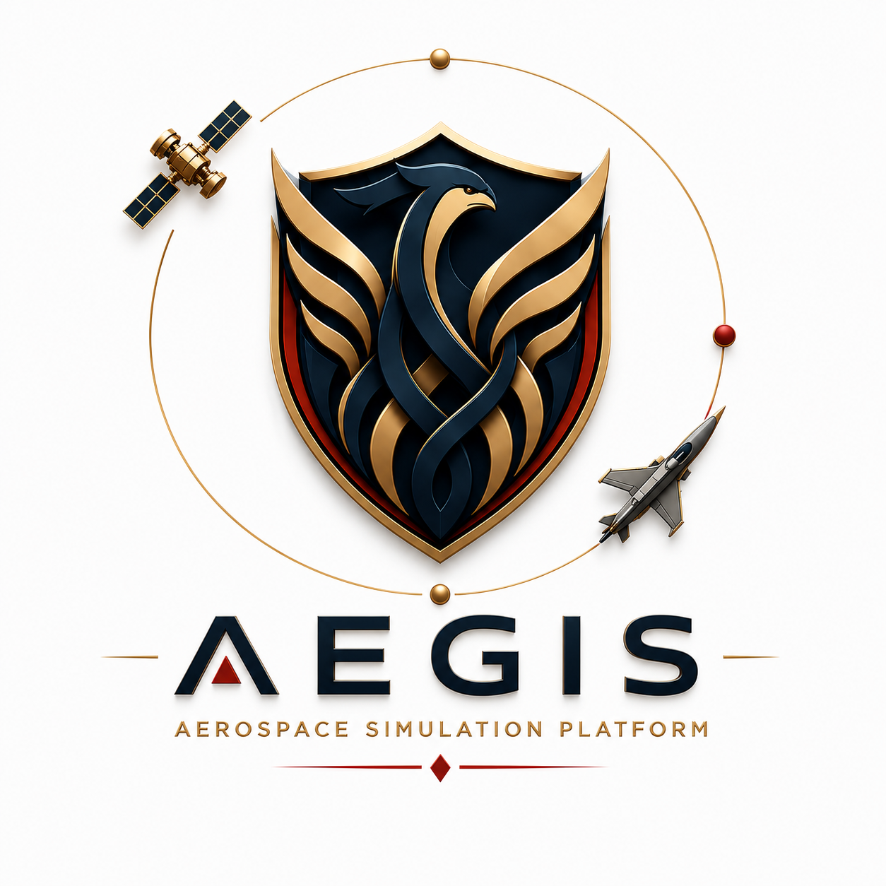
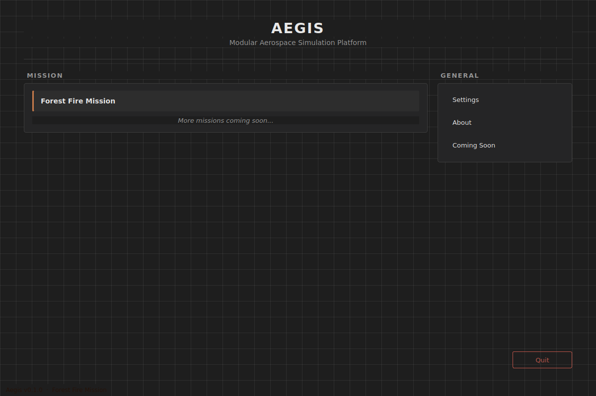
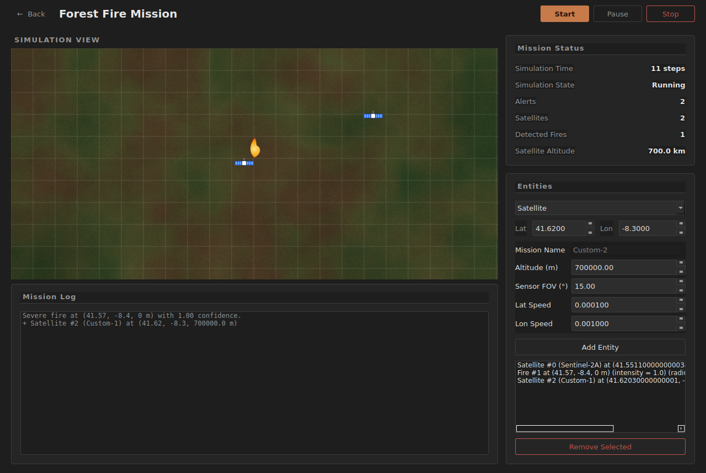
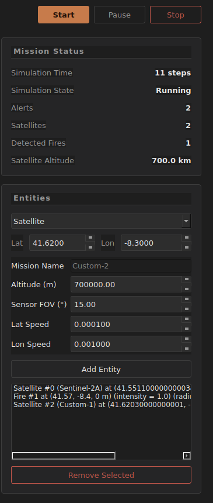
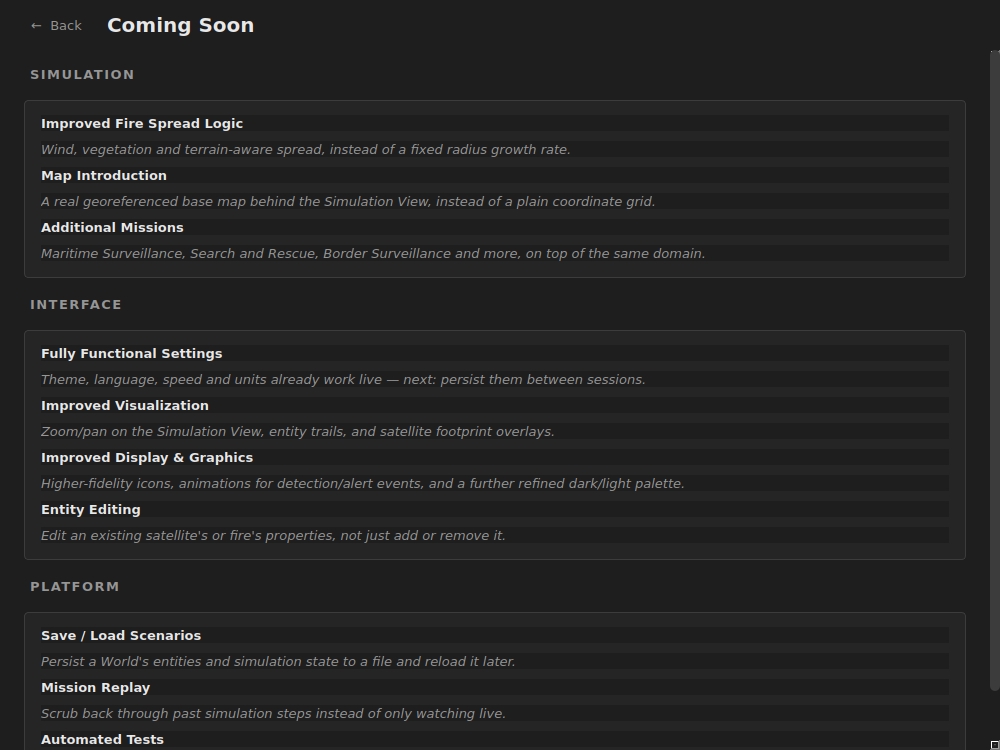
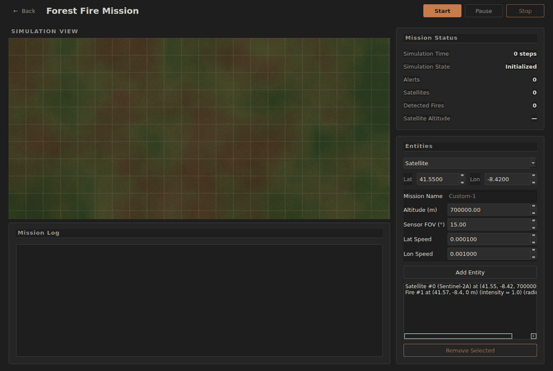
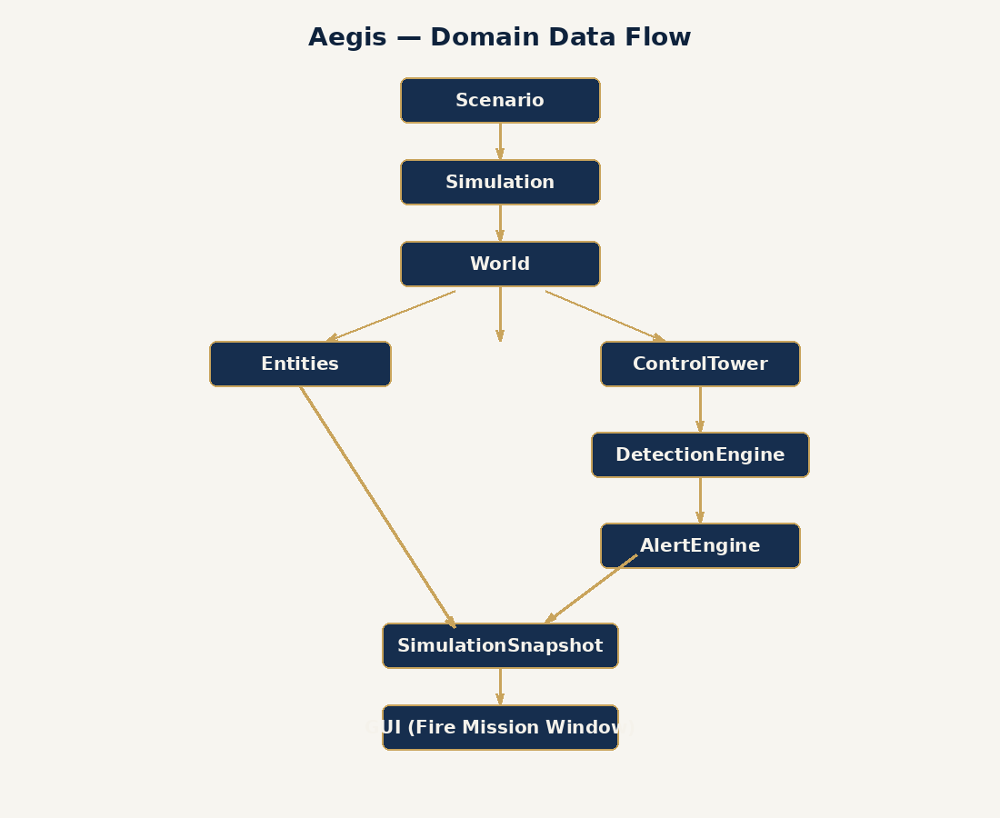
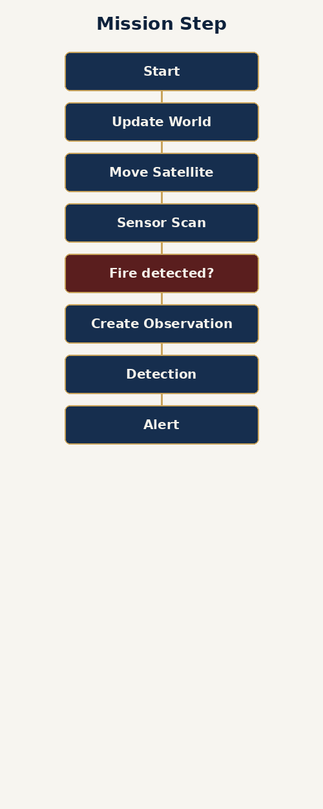
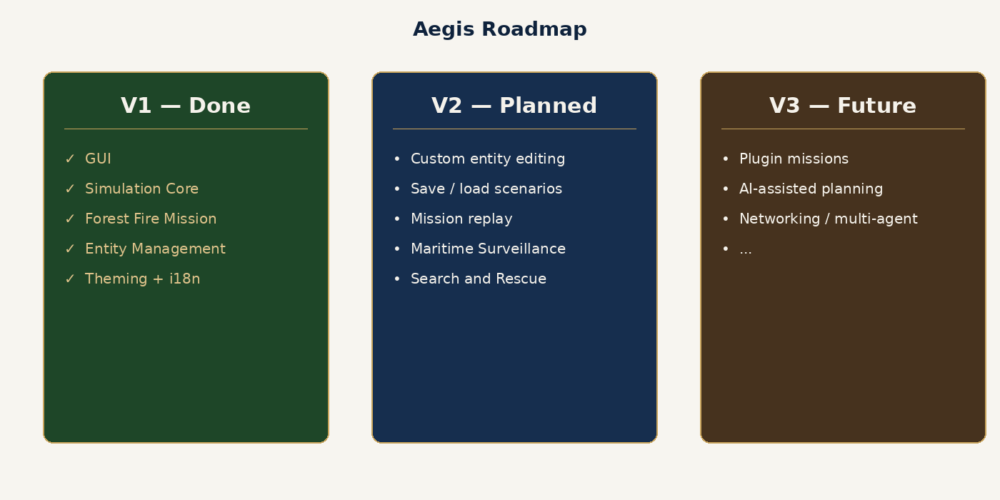

<p align="center">
  
</p>

<p align="center">

A software engineering project focused on the design and simulation of autonomous aerospace missions through a modular and extensible architecture.

</p>

---

# Overview

AEGIS is a modular aerospace simulation platform developed as a software engineering portfolio project inspired by modern aerospace systems.

Rather than implementing a single-purpose simulation, the project aims to provide a reusable architecture capable of supporting multiple mission profiles with minimal code changes.

The current implementation focuses on **forest fire detection using Earth observation satellites**, while the platform has been designed with future expansion in mind.

---

# Gallery

## Home Window

<p align="center">

</p>

---

## Fire Mission

<p align="center">

</p>

---

## Running Simulation

<p align="center">

</p>

---

## Alert System

<p align="center">

</p>

---

## Settings

<p align="center">

</p>

---

## Upcoming Features

<p align="center">

</p>

---

## Simulation Animation

<p align="center">

</p>

---

# Current Mission

### Forest Fire Detection

The first mission simulates the complete workflow of detecting forest fires using Earth observation satellites.

Current simulation pipeline:

- Satellite operation
- Sensor observations
- Observation processing
- Fire detection
- Confidence estimation
- Alert generation
- Simulation snapshots

---

# Features

Current version includes:

- Modular simulation engine
- Desktop application built with PySide6
- Object-Oriented architecture
- Domain-Driven Design inspired structure
- Satellite modelling
- Sensor simulation
- Forest fire entities
- Detection engine
- Alert engine
- Simulation snapshots
- Mission-based architecture
- Extensible project structure

---

# Software Architecture

<p align="center">

</p>

The project separates the graphical interface from the simulation core, allowing new missions and simulation components to be added independently.

---

# Simulation Workflow

<p align="center">

</p>

Each simulation step follows a structured processing pipeline:

1. Update world state
2. Update entities
3. Sensor observations
4. Detection processing
5. Alert generation
6. Snapshot creation

---

# Repository Structure

```text
Aegis
│
├── assets/
│   ├── animations/
│   ├── diagrams/
│   ├── logo/
│   └── screenshots/
│
├── docs/
│
├── src/
│   ├── domain/
│   ├── gui/
│   └── main.py
│
├── tests/
│
├── configs/
│
├── README.md
└── LICENSE
```

---

# Technologies

| Category | Technology |
|-----------|------------|
| Language | Python 3 |
| GUI | PySide6 |
| Architecture | Object-Oriented Programming |
| Design | Domain-Driven Design (inspired) |
| Version Control | Git |
| Repository | GitHub |

---

# Design Principles

The project follows several software engineering principles:

- Separation of Concerns
- Composition over Inheritance
- Single Responsibility Principle
- Modular architecture
- Event-based communication
- Incremental development
- Extensibility by design

---

# Future Development

Future versions are expected to include:

- Interactive world map
- Configurable missions
- Entity creation and removal
- Mission editor
- Scenario persistence
- Multiple satellites
- Multi-agent simulations
- Statistics dashboard
- Additional aerospace missions

---

# Roadmap

<p align="center">

</p>

---

# Why AEGIS?

The long-term objective of AEGIS is not simply to simulate a single aerospace scenario, but to provide a reusable platform capable of supporting a wide range of autonomous aerospace missions.

Potential future applications include:

- Forest fire monitoring
- Maritime surveillance
- Search and Rescue (SAR)
- Environmental monitoring
- Border surveillance
- Reconnaissance missions
- Earth observation
- Autonomous multi-agent systems

---

# Author

**Francisco Oliveira**

BSc Aerospace Engineering Student

University of Minho

GitHub:
https://github.com/francisco726

LinkedIn:
https://www.linkedin.com/in/francisco-oliveira-1b0b11297/overlay/1778612511387/single-media-viewer?profileId=ACoAAEfjzNQBJjVuTUVPYD1hIaDSXL0xds5dVjs

---

# License

This project is intended for educational and portfolio purposes.
