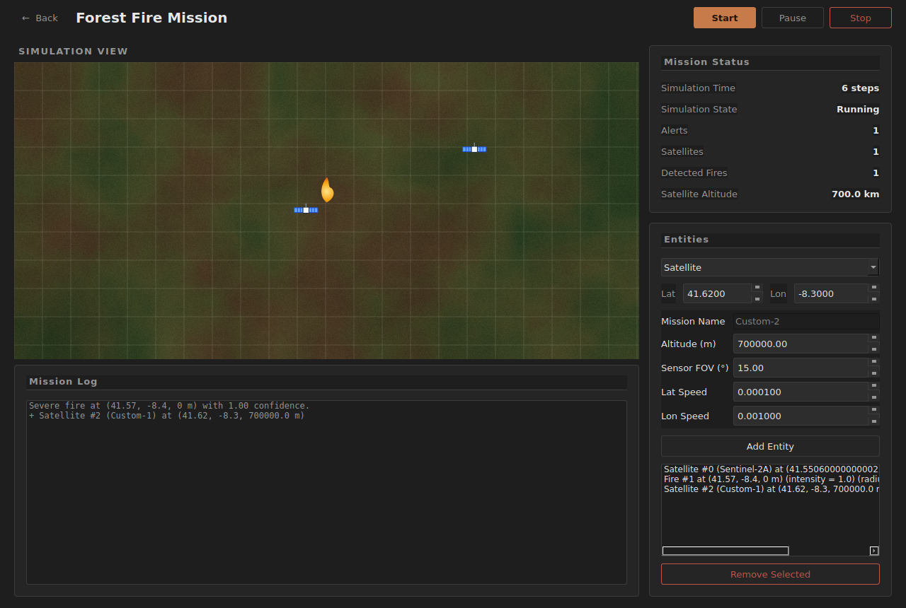
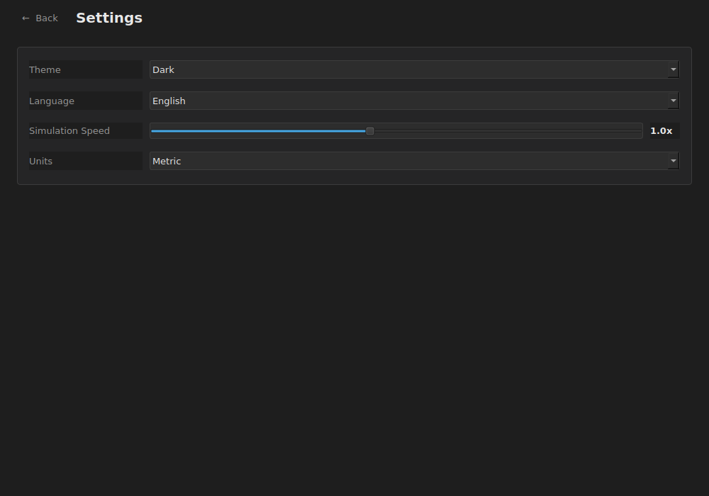

<div align="center">

# Aegis

**Modular Aerospace Mission Simulation Platform**

*Domain-driven simulation core · PySide6 desktop GUI · built as a software engineering portfolio project*


-41CD52?logo=qt&logoColor=white)


</div>

---

## Overview

Aegis is a modular aerospace mission simulation framework. It models and evaluates
cooperative missions involving autonomous assets — satellites and, in future
missions, UAVs and other platforms — through a strictly separated **domain layer**
(pure Python simulation logic) and a **GUI layer** (PySide6) that only ever
observes and drives it.

The first reference mission, **Forest Fire Detection**, coordinates an Earth
observation satellite's sensor sweeps with a fire's spread and intensity, running
detection and alerting logic through the same pipeline any future mission
(Maritime Surveillance, Search and Rescue, Border Surveillance, ...) will reuse
without any change to the simulation core.

This is not just a simulation — it is a demonstration of software engineering
practice: Domain-Driven Design, Clean Architecture layering, a componentised and
themeable GUI, internationalisation, and a documented rationale behind every
architectural decision.

## Screenshots

**Home** — mission launcher and navigation hub.


**Forest Fire Mission** — live simulation view, mission status, and entity
management, all backed by the same `Simulation` object.



**Settings** — theme, language, simulation speed, and units, all live and
observable across every open window.



## Core Principles

These rules have held since the project's first day and are enforced throughout
the codebase (see [`docs/Software_Architecture.docx`](docs) for the full
rationale):

1. **The domain is sovereign.** All simulation logic — movement, sensing,
   detection, alerting, state transitions — lives in `domain/` and has zero
   dependency on anything in `gui/`.
2. **The GUI is a client, nothing more.** It only ever calls
   `simulation.start()/pause()/resume()/stop()/step()` and
   `world.add_entity()/remove_entity()`, and only ever reads a
   `SimulationSnapshot` — never the live `World` directly.
3. **Built for more than one mission.** Forest Fire is the first mission, not
   the only one. Nothing in `Simulation`, `SimulationSnapshot`, or the
   navigation pattern assumes it's the last.
4. **No duplicated GUI code.** Anything used by more than one window — headers,
   panels, status rows, back navigation — is a shared component under
   `gui/components/`, not copy-pasted.

## Features

- **Real-time simulation control** — start, pause, resume, and stop a mission,
  advancing on a configurable interval.
- **Live entity management** — add or remove satellites and fires mid-simulation,
  with every domain-exposed property (position, altitude, sensor field of view,
  angular speed, fire intensity/radius/spread rate) editable from the GUI.
- **Procedural map & satellite/fire icons** — a fractal-noise-generated terrain
  backdrop and vector-drawn entity icons, no external image assets required.
- **Optional rotating Earth background** — drop a real equirectangular Earth
  texture into `gui/assets/` and the Home screen renders a true orthographic
  (not merely panned) rotating globe, cached to disk after first generation. Runs
  perfectly well without it, too — see [Optional: Rotating Earth](#optional-rotating-earth-background).
- **Live theming** — dark/light, switchable at runtime, applied instantly across
  every open window.
- **Bilingual (EN/PT)** — every label in the GUI is translated live, including
  windows currently open in the background.
- **Deduplicated mission log** — an unchanged alert is recorded once, not on
  every step it recurs.

## Getting Started

```bash
git clone <this-repo-url>
cd aegis
pip install -r requirements.txt
python main.py
```

`PySide6` is the only mandatory dependency. `numpy` and `Pillow` are optional —
needed only for the rotating Earth background described below.

### Optional: rotating Earth background

No image ships with this repository — none was fetched, drawn, or faked. To
enable it:

1. Download a real, public-domain equirectangular Earth texture, e.g. NASA's
   Blue Marble:
   `https://eoimages.gsfc.nasa.gov/images/imagerecords/73000/73776/world.topo.bathy.200408.3x5400x2700.jpg`
2. Save it as `gui/assets/earth_equirectangular.jpg`.
3. `pip install numpy Pillow` (if not already installed).
4. Run the app. The first launch takes a few seconds to project and cache 72
   rotation frames; every launch after that is instant.

Without the texture, the Home screen uses a flat reference grid instead — the
app never fails to start over a missing optional asset.

## Project Structure

```
aegis/
├─ main.py
├─ requirements.txt
├─ domain/              # pure simulation logic, zero GUI dependency
│  ├─ entity.py, position.py
│  ├─ satellite.py, sensor.py, fire.py
│  ├─ observation.py, detection.py, alert.py
│  ├─ detection_engine.py, alert_engine.py, control_tower.py
│  ├─ world.py, scenario.py
│  └─ simulation.py, simulation_snapshot.py, simulation_state.py
└─ gui/                 # PySide6 client of the domain layer
   ├─ theme.py, translations.py, app_settings.py
   ├─ home_window.py, fire_mission_window.py
   ├─ settings_window.py, about_window.py, coming_soon_window.py
   ├─ components/       # every widget shared by more than one window
   └─ assets/           # optional user-supplied Earth texture (not included)
```

See [`docs/Repository_Structure.docx`](docs) for a file-by-file description of
what each module is responsible for.

## Documentation

The `docs/` folder contains the full engineering documentation set behind this
project:

| Document | Contents |
|---|---|
| `Vision.docx` | Why the project exists, its intended audience, and its guiding philosophy |
| `Concept_of_Operations.docx` | Who uses Aegis, in what scenarios, and how a mission session actually unfolds |
| `System_Requirements.docx` | Functional and non-functional requirements, with stable IDs |
| `System_Architecture.docx` | System-level boundaries, data flow, technology stack, quality attributes |
| `Software_Architecture.docx` | Class-by-class domain/GUI design, design patterns, extension points |
| `Repository_Structure.docx` | Full file-by-file map of the codebase and its conventions |

## Roadmap

See the in-app **Coming Soon** screen (Home → Coming Soon) for the full, current
V2 roadmap — improved fire spread logic, additional missions, entity editing,
save/load scenarios, mission replay, and automated tests, among others.

## License

MIT — see [`LICENSE`](LICENSE).

## Author

**Francisco Rodrigues Oliveira**
